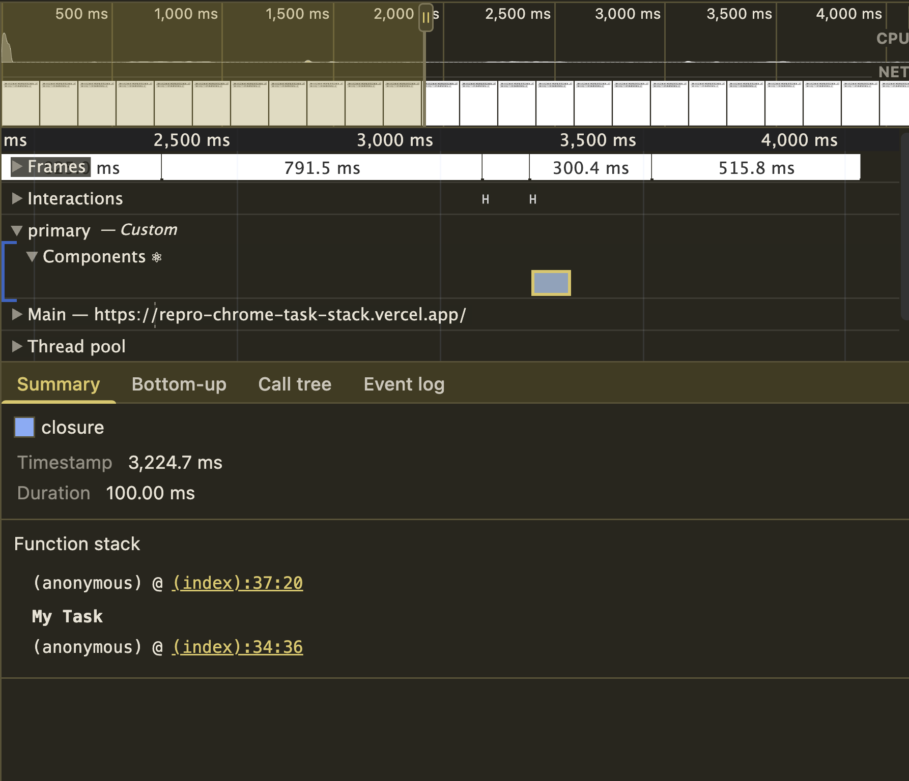
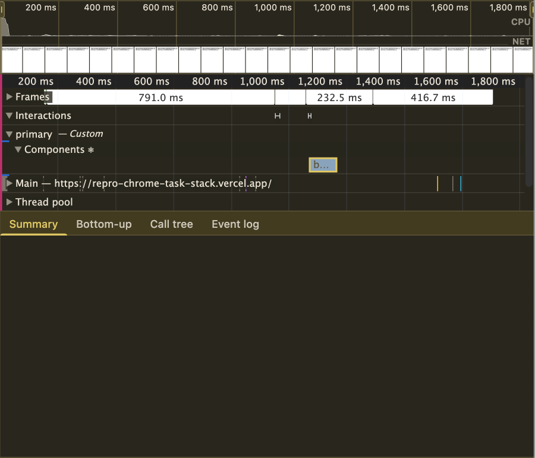

# Missing stack trace in Chrome DevTools Performance tab for console.timeStamp called via task.run with bound console.timeStamp

Repro for TODO: file crbug.

## Reproduction steps

With MacOS Chrome Version 144.0.7559.60 (Official Build) (arm64)

1. Go to https://repro-chrome-task-stack.vercel.app/
1. Open Chrome DevTools Performance tab
1. Click both buttons

See [reproduction recording](./repro-steps.mp4).

## Expected behavior

`task.run(console.timeStamp.bind(...))` and `task.run(() => console.timeStamp(...))` should include a stack trace in the "Summary" view of the performance event.

## Actual behavior

Only `task.run(() => console.timeStamp(...))` includes a stack trace. The other one shows and empty section.

## Additional notes

A bound `performance.measure` is also missing a stack trace.
